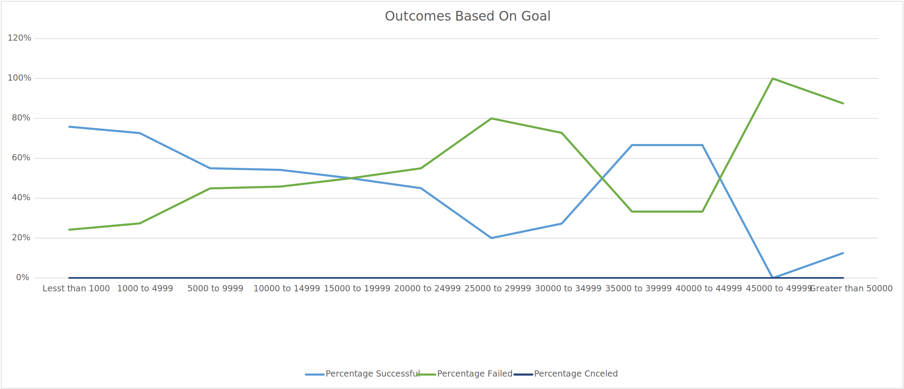

# Kickstarter-analysis
performing analysis onkickstarter data to find trends
# Kickstarting with Excel

## Overview of Project:

### Purpose

   This analysis is to draw conclusion and further visualize the data on the dataset,\"Kickstarter_Challenge
   --
   I tried to help Louise for better visualize and understand how other campaigns did based on their launch dates and purpose of
   this challenge is collect and organize data in various ways in  to make unreadable data, to our client Louise.
   
 ## Analysis and Challenges
    
 I am able to prefers analysis by creating two sheets in Kickstarter_Challenge , named "Outcomes Based on Launch Date",
 and Outcomes Based on Goals
  
  -The first analysis makes using a pivot table to help visualize number of successful,failed and canceled theater campaigns
  month and could be filtered by year as well as by parent category in  to see different types of
 
  -The second analysis vizualized the Outcomes based on a range of goals of various campaigns and data from dataset  
  graphing the data based on the percentage of sucess,failure and cancelation.
            
  #### Data Visualizations
  1)
  
  2)
               
   ### Analysis of Outcomes Based on Launch Date
   
       
   ### Analysis of Outcomes Bases on Goals
       
       
   # Result
   What are two conclusions you can draw about the Outcomes based on Launced
       Data that the months of May and June both have a greater success rate. A bar chart wouldn't be able to convey this information in the same manner.
       
       
   What can you conclude about the Outcomes based on Goals?
       Outcomes based on Goals balens using line chart of central tendency help us finding the mean and median for each dataset's.
       
   What are some limitations of this dataset?
       We need to analyze a variety of company to draw more important undurstanding and figure out how important results.
       
  What are some other possible tables and/or graphs that we could create?
   - Column Graph
   - Line Graph
   - Area Graph
 
